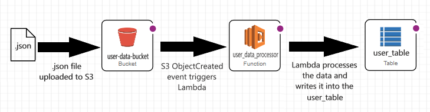

# Zurich Cloud Hackathon Solution - Henrik Rudolf Élő
This project was created for the [Zurich cloud hackathon challenge](https://nuwe.io/dev/competitions/zurich-cloud-hackathon/online-preselection-cloud-challenge) 

## Infrastructure and decisions taken


I created an S3 bucket where the user data can be uploaded. 

The Lambda is triggered with the S3's ObjectCreated event. 
When the Lambda is triggered it downloads the JSON file from the S3 bucket and transforms the users into the databases format. 

After the Lambda collects and transforms all the users it writes them into the DynamoDB table.

I decided to put the user and car entities into the same table, this way I do not have to worry about fetching the car object for the user or keeping the car reference up to date. 

This also makes the error handling easier, because if the users and cars have separate tables and something happens during the writing of the cars, then there could be users that have a references to car entries that do not exist.

In DynamoDB nested objects can be stored, but querying and indexing them is pretty hard so I decided to flatten out the user object. 

To flatten the user object I moved the car objects' attributes into the user objects' attributes like in the example below.

This is a user object
```json
{
    "id": "123",
    "car": {
        "make": "Seat",
        "model": "Leon"
        //...
    }
    //...
}
```
This is the flattened user object: 
```json
{
    "id": "123",
    "car.make": "Seat",
    "car.model": "Leon"
    //...
}
```

One drawback of this solution is that if later a user can have multiple cars this schema couldn't easily support it. 